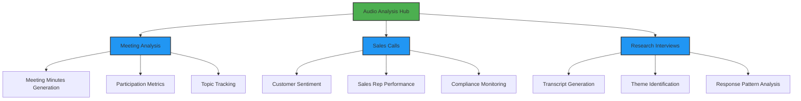

# SpeakerLens: AI-Powered Transcript Analysis

This project was born out of a real need I experienced during my course curriculum's capstone project meetings. As our team discussions grew longer and more complex, I found myself wishing for a tool that could automatically track who said what and highlight the key points from each speaker. What started as a solution to my own problem - managing meeting notes and tracking speaker contributions - quickly evolved into a comprehensive audio analysis platform that could serve various business needs.

The tool combines my interests in data visualization and audio processing to create meaningful insights from spoken conversations. While it began as a solution for academic meetings, I realized its potential applications in various professional settings - from sales calls to research interviews. I'm excited to continue adding features and improving its capabilities!

## ✨ App Demo

For the sake of demonstration, I've chosen an audio clip extracted from the video of a staff meeting with multiple speakers on Youtube:

*Upload an audio file of your choice:*


*Entire transcript of the audio file, followed by speaker wise transcripts:*


*Visualization of speaking stats of all speakers:*


*Analytics of conversation flow:*


*Summary of the transcript, relevant entites, sentiment analysis, and sensitive content check:*


**And just to demonstrate that the tool does indeed detect multiple topics and any sensitive content, this is an analysis of a 'Between Two Ferns' interview!:**


## 🎯 Business Value & Market Differentiation

While there are several transcription tools available, this application stands out by providing a comprehensive, integrated analysis platform that combines multiple aspects of audio intelligence:

### Unique Value Proposition
- **Integrated Analysis Dashboard**: Unlike basic transcription services that only provide text output, this tool combines speaker identification, sentiment analysis, content safety, and visual analytics in a single platform
- **Interactive Visualizations**: Provides immediate visual insights through:
  - Speaker engagement metrics and talk-time distribution
  - Conversation flow timelines
  - Entity distribution analysis
  - Topic confidence visualization
  - Sentiment analysis charts
- **Intelligent Q&A System**: RAG-powered question answering that:
  - Provides accurate answers with source citations
  - Maintains context across the conversation
  - Links answers to specific speakers and segments
- **Detailed Speaker Analytics**: Goes beyond basic transcription by providing:
  - Speaker-specific transcripts
  - Speaking time analysis
  - Entity mention tracking per speaker

### Practical Applications



The tool is particularly valuable in three key areas:

1. **Meeting Analysis**
   - Automated transcription with speaker identification
   - Analysis of speaking time and participation balance
   - Topic tracking and sentiment monitoring

2. **Sales Calls**
   - Customer-agent interaction patterns
   - Real-time sentiment tracking
   - Compliance monitoring for regulated industries

3. **Research Interviews**
   - Accurate multi-speaker transcription
   - Theme identification and categorization
   - Response pattern analysis

Each use case leverages the core features of speaker diarization, sentiment analysis, and topic detection while serving specific business needs.

### Integration Possibilities
- **Virtual Meeting Platforms**: Potential integration with Zoom, Teams, or other conferencing tools
- **Learning Management Systems**: Plugin capabilities for educational platforms
- **Call Center Software**: Integration for customer service analysis
- **Content Management Systems**: API integration for content processing and analysis

## 🛠️ Tech Stack

### Core Technologies
- **Python 3.8+**: Primary programming language
- **Streamlit**: Web application framework for creating the interactive dashboard
- **Matplotlib & Plotly**: Data visualization libraries for creating charts and graphs
- **WordCloud**: Text visualization for keyword analysis

### AI & Machine Learning
- **AssemblyAI API**: 
  - Speech-to-text transcription
  - Speaker diarization (speaker identification)
  - Topic detection
  - Entity recognition
  - Sentiment analysis
  - Content safety detection

- **OpenAI API**:
  - GPT-4 for question answering and text analysis
  - text-embedding-ada-002 for text embeddings in RAG system

### RAG (Retrieval Augmented Generation)
- **LangChain**: Framework for building RAG pipeline
- **ChromaDB**: Vector database for storing and retrieving embeddings
- **tiktoken**: Token counting and text splitting

### Data Processing
- **python-dotenv**: Environment variable management
- **NumPy & Pandas**: Data manipulation and analysis
- **Collections**: Data structure management

### Visualization Components
- **Matplotlib**: 
  - Speaker timeline visualization
  - Entity distribution charts
  - Topic confidence graphs
  - Sentiment analysis pie charts

- **WordCloud**:
  - Entity visualization
  - Keyword frequency representation

### Development Tools
- **Git**: Version control
- **VS Code**: Development environment
- **requirements.txt**: Dependency management

Each technology was chosen for specific reasons:
- **Streamlit**: Enables rapid development of data apps with minimal frontend code
- **AssemblyAI**: Provides comprehensive audio intelligence features in a single API
- **OpenAI**: Powers the RAG system with state-of-the-art language models
- **LangChain**: Simplifies the implementation of complex RAG pipelines
- **ChromaDB**: Efficient vector storage and retrieval for semantic search
- **Matplotlib**: Flexible, publication-quality figures

While AssemblyAI offers LeMUR for transcript question-answering, this project implements a custom RAG pipeline using OpenAI embeddings and LangChain. This choice provides greater flexibility in handling longer transcripts, allows for customization of the retrieval process, and enables future extensions of the system. The implementation gives full control over how transcripts are chunked, embedded, and retrieved, which is crucial for maintaining accuracy with lengthy conversations and complex queries.

## 🔧 Technical Implementation

This project leverages AssemblyAI's powerful API suite for its core functionality. Here's a breakdown of the implementation:

### Audio Processing Pipeline
1. **File Processing & Upload**
   - Secure file handling and validation
   - Efficient audio file processing
   - AssemblyAI API integration
   - Status tracking and error handling

2. **Speaker Diarization**
   - Advanced speaker separation
   - Custom color-coding system
   - Timeline-based visualization
   - Speaker-specific analytics

3. **Content Analysis**
   - Entity detection and categorization
   - Temporal sentiment analysis
   - Topic identification
   - Content safety screening

4. **Data Visualization**
   - Interactive charts and graphs
   - Real-time data processing
   - Custom color schemes
   - Responsive design

The application follows a modular architecture with clear separation of concerns:
- Audio processing (`assemblyai_processing.py`)
- Frontend interface (`app.py`)
- Data visualization (integrated throughout)

This structure ensures maintainability and makes it easy to add new features or modify existing ones.

## ✨ Key Features

- **Transcription and Speaker Diarization**: Convert audio into text while identifying individual speakers
- **Interactive Dashboard**:
  - Full and speaker-wise transcripts
  - Speaker timeline visualization
  - Speaking time distribution
  - Entity detection and visualization
  - Topic analysis
  - Sentiment analysis
  - Content safety check
- **Entity Analysis**: Identifies and visualizes key entities (people, places, organizations) mentioned in the audio
- **Advanced Analytics**:
  - Conversation flow timeline
  - Topic confidence visualization
  - Sentiment distribution charts
  - Content safety metrics
- **Question Answering**: RAG-powered system to answer questions about the transcript with source attribution
- **Speaker-Specific Analysis**: Color-coded sections for each speaker with individual analytics

## 🛠️ Getting Started

### Prerequisites

- **Python 3.7+**: Ensure Python is installed. You can check with `python --version`.
- **AssemblyAI API Key**: Sign up at [AssemblyAI](https://www.assemblyai.com/) to get your API key. AssemblyAI offers a free usage tier with a limit of 5 hours of audio processing per month, which is perfect for testing and smaller projects.
- **Streamlit**: For the frontend, Streamlit will be used to host the app.

### Installation

1. **Clone the repository**:
   ```bash
   git clone https://github.com/adityakamath1997/Speech-Diarization-Project.git
   cd Speech-Diarization-Project
   ```

2. **Set up a virtual environment**:
   ```bash
   python -m venv venv
   source venv/bin/activate  # On Windows, use venv\Scripts\activate
   ```

3. **Install dependencies**:
   ```bash
   pip install -r requirements.txt
   ```

4. **Set up environment variables**:
   - In the root directory, create a `.env` file and add your API key:
     ```plaintext
     ASSEMBLYAI_API_KEY=your_assemblyai_api_key
     ```

5. **Run the application**:
   ```bash
   streamlit run app.py
   ```

   Once the application starts:
   1. Open your browser to the displayed URL (typically http://localhost:8501)
   2. Create a data folder in the root directory if it doesn't exist already!
   3. Upload an MP3 file using the file uploader
   4. Wait for the processing to complete (you'll see a progress bar)
   5. Explore the analysis through different tabs:
      - View the full and speaker-wise transcripts
      - Analyze speaker participation metrics
      - Explore keyword distributions
      - Check sentiment analysis results
      - Review detected entities and topics
   6. Ask questions about the transcript using the chatbot!

   **Note**: A sample meeting audio file with multiple speakers is included in the `samples` folder for testing. You can:
   - Use this sample file to quickly test the app's features
   - Or upload any MP3 file of your choice (recommended length: 2-15 minutes)
   
   **Processing Time**: Depending on the audio length, initial processing may take 1-3 minutes.

## 📁 Directory Structure

Here’s an overview of the main directories and files in this project:

```plaintext
Speech-Diarization-Project/
├── src/
│   └── assemblyai_processing.py  # Core processing logic
├── data/
│   └── raw/                      # Audio file storage (gitignored)
│       └── .gitkeep
├── images/                       # Demo screenshots
│   ├── demo1.png
│   ├── demo2.png
│   └── ...
├── app.py                        # Main Streamlit application
├── requirements.txt              # Project dependencies
├── .env.example                  # Environment variables template
├── .gitignore                   # Git ignore configuration
└── README.md                    # Project documentation
```

## 💡 Learning Journey

This project has been transformative for my technical growth. What began as a simple need to track meeting discussions led me deep into the world of AI and data visualization. Through building this tool, I've gained hands-on experience with:

- **Audio Processing**: Learning how to handle and process audio data efficiently
- **Data Visualization**: Developing interactive and informative visualizations using matplotlib and streamlit
- **API Integration**: Working with AssemblyAI's powerful API suite
- **Web Development**: Building an interactive web application using Streamlit, including custom styling, responsive layouts, and user-friendly interfaces

The project has especially enhanced my data visualization skills - from creating basic charts to developing complex, interactive dashboards that provide immediate value to users. Each visualization was carefully designed to answer specific questions about the conversation dynamics.

## 🚀 Future Work

There’s a lot more I intend to do with this project! Here a few features I plan on implementing in the near future.

- **Enhanced AssemblyAI Features**: Currently, the project uses only a subset of AssemblyAI’s capabilities. Future updates will explore and integrate more of its features, such as advanced content safety analysis, summarization, and more detailed audio insights.
- **Speaker Profile Identification**: Analyze and identify speaker profiles, such as age or gender, using additional machine learning models.
- **Real-time Processing**: Expand support for real-time audio streaming and live analysis to provide insights as audio is being recorded or played. I think AssemblyAI already has capabilities for this, but I haven't yet experimented with real-time processing.
- **Topic Modeling and Improved Visualizations**: Incorporate additional NLP techniques for enhanced topic detection and provide more user-friendly and interactive visual insights, making it easier for users to understand complex audio data at a glance.
- **More Visualizations!**: Add further visualizations for additional features I'm hoping to implement.

... and a lot more that I haven't yet noted down!

